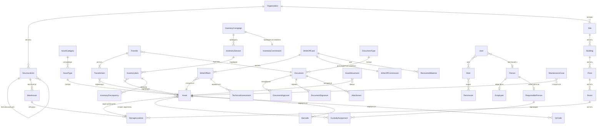
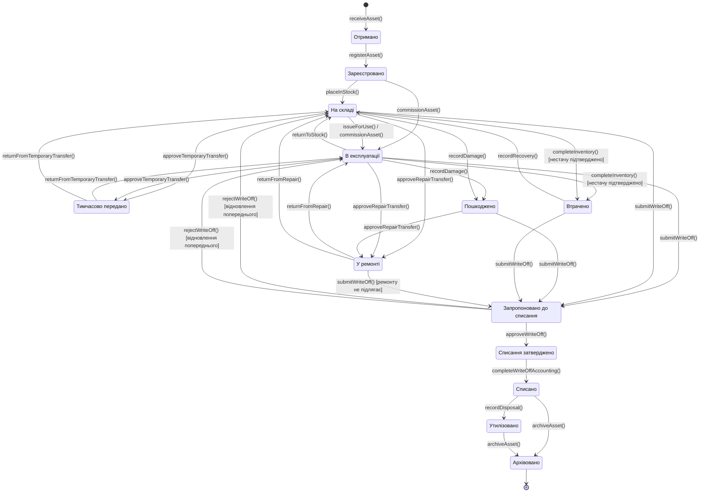
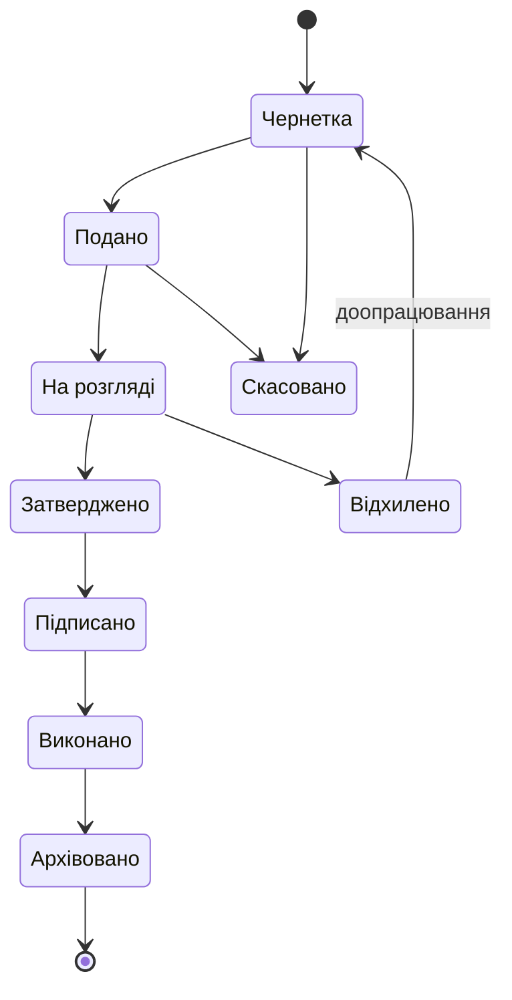

# Доменна модель

**Статус:** Чернетка · **Версія:** 0.1 · **Оновлено:** 2026-10-02

Це **концептуальна** модель, а не схема бази даних. Деталізація до рівня атрибутів — у [entities.md](../data/entities.md). Назви сутностей наведено англійською, бо вони стануть ідентифікаторами в коді.

## 1. Предметні області

| Область | Сутності |
|---|---|
| Організація та розташування | Organization, StructuralUnit, Site, Building, Floor, Room, Location, Warehouse, StorageLocation |
| Майно | Asset, AssetCategory, AssetType, AssetStatus, AssetCondition |
| Особи та закріплення | Person, Employee, ResponsiblePerson, CustodyAssignment |
| Переміщення | AssetMovement, Transfer, TransferItem |
| Інвентаризація | InventoryCampaign, InventoryCommission, InventorySession, InventoryItem, InventoryDiscrepancy |
| Списання | WriteOffCase, WriteOffCommission, WriteOffItem, TechnicalAssessment, RecoveredMaterial |
| Обслуговування | MaintenanceCase |
| Документи | Document, DocumentType, DocumentApproval, DocumentSignature, Attachment |
| Ідентифікація | Barcode, QrCode |
| Доступ | User, Role, Permission |
| Аудит | AuditEvent |
| Конфігурація | ReferenceData |

## 2. Основні зв'язки



Примітки:

- `Location` — абстрактне поняття будь-якого вузла фізичної ієрархії. Site, Building, Floor, Room і StorageLocation — його спеціалізації.
- `Warehouse` — організаційно-облікове поняття. Склад об'єднує місця зберігання, його експлуатує структурний підрозділ, і за ним закріплено завідувача складу. Склад **не** є текстовим рядком.
- `AssetStatus` і `AssetCondition` — контрольовані значення. Статусом керує автомат станів, наведений нижче. Технічний стан (справний, потребує ремонту, непридатний) — довідникове значення.

## 3. Ієрархія розташування

```
Організація (Organization)
-> Структурний підрозділ (Structural Unit)
-> Майданчик / територія (Site)
-> Будівля (Building)
-> Поверх (Floor)
-> Приміщення (Room)
-> Місце зберігання (Storage Location)
```

- Кожен рівень — окремий запис зі строком дії. Розташування, на яке вже є посилання, деактивується, але ніколи не видаляється.
- Дані про розташування також можуть бути чутливими. Розташування майна з обмеженим доступом підлягає класифікації даних (див. [data-classification.md](data-classification.md)).

## 4. Модель закріплення за МВО

```
Asset -> CustodyAssignment -> ResponsiblePerson
```

- CustodyAssignment фіксує:
  - майно;
  - МВО;
  - дату початку та закінчення дії;
  - документальну підставу (Document);
  - операцію, яка його створила або завершила.
- У кожен момент часу одиниця майна має не більше одного *чинного* основного закріплення (BR-09). Чи потрібна спільна відповідальність, — відкрите питання OQ-10.
- Зміна МВО закриває поточне закріплення й відкриває нове. Старе закріплення ніколи не редагується (BR-10).
- ResponsiblePerson пов'язана з Person і, за потреби, з Employee. Персональні дані зберігаються один раз у Person, у мінімальному обсязі (див. [data-classification.md](data-classification.md)).

## 5. Майно та його історія

Запис `Asset` містить **поточні** ідентифікаційні та облікові атрибути. Історичні факти зберігаються в окремих сутностях:

| Історична сутність | Що фіксує |
|---|---|
| AssetMovement | Кожне фізичне переміщення (звідки/куди, операція, документ) |
| AssetCustody | Закріплення за МВО в часі (див. CustodyAssignment) |
| AssetLocationHistory | Розташування в часі |
| AssetStatusHistory | Кожну зміну статусу з операцією, виконавцем і документом |
| AssetValuation | Первісну вартість, переоцінки, знімки зносу / залишкової вартості |
| AssetMaintenance | Епізоди обслуговування та ремонту |
| AssetInventoryResult | Результат кожної інвентаризаційної перевірки |
| AssetWriteOff | Участь у справах списання |
| AssetDocument | Зв'язок між майном і кожним документом, що його стосується |

Поля поточного стану в Asset — це проєкція завершених операцій. Їх оновлює лише та операція, яка водночас записує відповідну історію.

## 6. Автомат станів майна

Статус централізований і змінюється лише через перевірені операції (AD-01).



Стан «На інвентаризації» (`Under Inventory`) свідомо **не** є основним станом на діаграмі. Він моделюється як **накладна ознака** (інвентаризаційне блокування). Її встановлює активна кампанія інвентаризації, а знімає `completeInventory()`. Так основний статус зберігається. Поки блокування діє, конкурентні операції з цим майном (передача, списання) заборонені або потребують явного дозволу згідно з політикою (BR-21).

Відкриті питання:

| ID | Питання |
|---|---|
| OQ-05 | `Under Inventory` — накладна ознака (запропоновано) чи основний статус? |
| OQ-06 | `Damaged` — статус життєвого циклу, значення AssetCondition чи і те, і те? Пропозиція: обидва. Технічний стан фіксує фізичний стан, а статус використовується лише там, де нормативний акт вимагає формального стану пошкодження. |
| OQ-07 | Порядок станів «Списано» та «Утилізовано». Для деяких категорій фізична утилізація або розбирання може передувати завершенню облікового списання. Порядок має налаштовуватися для кожного варіанта процесу. |

Таблиця допустимих переходів, їхніх умов і потрібних документів — це конфігурація, яка версіонується та аудитується. Її не можна розпорошувати по коду інтерфейсу.

## 7. Категорія → нормативний акт → процес

```
AssetCategory -> ApplicableRegulation -> ApplicableWorkflow
```

- Кожна категорія майна (AssetCategory), а за потреби й тип майна (AssetType), посилається на один або кілька застосовних нормативних актів із [реєстру нормативних джерел](../compliance/legislation-register.md). Для кожного типу операції (надходження, передача, ремонт, інвентаризація, списання) вона визначає варіант процесу.
- Варіант процесу визначає:
  - етапи;
  - потрібні типи документів;
  - вимоги до комісії;
  - рівні затвердження;
  - обмеження щодо розподілу обов'язків;
  - правила зберігання.
- Для майна, що регулюється **внутрішніми або обмеженими відомчими документами**, мають існувати категорії-заповнювачі. Приклади — майно спеціального призначення, засоби зв'язку, засоби криптографічного захисту інформації. Їхні процеси визначаються лише після того, як замовник надасть відповідні правила належним каналом (див. [legislation-register.md](../compliance/legislation-register.md#4-внутрішні-нормативні-документи-замовника)).

## 8. Життєвий цикл документа



- Не кожен тип документа проходить усі стани. Наприклад, документ без вимоги підпису може переходити з «Затверджено» одразу до «Виконано». Допустимі переходи — частина конфігурації DocumentType.
- **Виконано** означає, що господарську операцію, підставою для якої є документ, проведено.
- Документ, що брав участь у проведеній операції, ніколи не видаляється (BR-04). Виправлення здійснюються через позначки «Замінено» або «Визнано недійсним» (див. [data-classification.md](data-classification.md) та [business-rules.md](../requirements/business-rules.md)).

## 9. Життєвий цикл справи списання

```
Ініційовано
-> Комісію створено
-> Огляд проведено
-> Супровідні документи зібрано
-> Подано
-> Затверджено | Відхилено
-> Утилізація або розбирання
-> Отримані матеріали оприбутковано
-> Облік завершено
-> Архівовано
```

Етапи та їх порядок визначаються для кожного варіанта процесу (див. §7). Детальний процес — у [write-off.md](../workflows/write-off.md).

## 10. Стани цілісності

Основні сутності використовують наведені нижче стани замість фізичного видалення:

- майно;
- передачі;
- інвентаризації;
- списання;
- документи;
- записи аудиту.

| Стан | Значення |
|---|---|
| Скасовано (Cancelled) | Зупинено до проведення. Облікових наслідків не мало. |
| Замінено (Superseded) | Замінено новішим записом, який на нього посилається. |
| Визнано недійсним (Invalidated) | Після проведення виявлено помилку. Сторнування чи виправлення здійснюється коригувальною операцією. |
| Архівовано (Archived) | Життєвий цикл завершено. Лише для читання. Зберігається відповідно до правил зберігання. |

Кожен перехід до одного з цих станів фіксує причину, виконавця, час і, де застосовно, документальну підставу.
