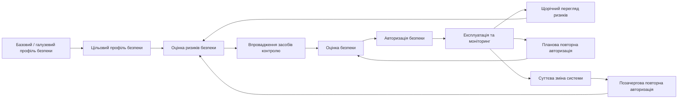

# Архітектура безпеки

**Статус:** Чернетка · **Версія:** 0.1 · **Оновлено:** 2026-10-02

Безпека розглядається як частина архітектури (AP-06). Цей документ описує архітектурну модель безпеки. Вимоги з прив'язкою до нормативних актів — у [security-requirements.md](../compliance/security-requirements.md).

> Нормативна база безпеки державних інформаційних систем України нещодавно змінилася. Приклад — постанова Кабінету Міністрів України № 712 від 18 червня 2025 року ([LEG-17](../compliance/legislation-register.md)). Проєкт **не** виходить із того, що самої лише побудови КСЗІ за попереднім підходом достатньо. Застосовна база, профілі та процедуру авторизації має підтвердити служба безпеки замовника з урахуванням роз'яснень Держспецзв'язку.

## 1. Життєвий цикл безпеки

Архітектура має підтримувати життєвий цикл безпеки, а не одноразову сертифікацію.

> Терміни «профіль безпеки», «авторизація безпеки» тощо слід узгодити з офіційним текстом постанови № 712 під час юридичної перевірки.

Архітектурні наслідки:

- **Межі системи**, компоненти, потоки даних та інтерфейси мають бути задокументовані й актуальні. Це вхідні дані для оцінки ризиків та авторизації.
- **Суттєві зміни** визначаються й відстежуються процесом керування змінами, бо можуть вимагати позачергової повторної авторизації. Приклади: нові інтеграції, нові категорії даних, зміна моделі розміщення, зміна механізму автентифікації (SEC-09).
- Засоби контролю безпеки простежуються до цільового профілю через [матрицю відповідності](../compliance/compliance-matrix.md).

## 2. Ідентифікація та доступ

| Засіб контролю | Архітектурна позиція |
|---|---|
| Централізоване керування ідентифікацією | Користувачі автентифікуються через централізованого постачальника ідентифікації, якщо він є (OQ-01). Для промислової експлуатації ISOM не веде ізольованого некерованого сховища користувачів. |
| Готовність до MFA | Шар автентифікації має підтримувати багатофакторну автентифікацію без переробки. Після ввімкнення MFA обов'язкова для привілейованих ролей. |
| RBAC | Дозволи надаються ролям. Ролі призначаються користувачам з **організаційними межами** (організація, структурний підрозділ, склад). |
| Мінімальні привілеї | Усе заборонено за замовчуванням. Ролі надають мінімум дозволів, потрібних для виконання обов'язків. |
| Розділення привілейованих ролей | Системний адміністратор, адміністратор безпеки та бізнес-ролі розділені. Жодна роль не поєднує всіх трьох. |
| Адміністрування ≠ бізнес-дані | Технічне адміністрування **не** включає доступу до бізнес-даних. Системний адміністратор може обслуговувати платформу, але не може читати чи змінювати дані про майно, закріплення чи персональні дані, якщо такий доступ не надано окремо, явно та з аудитом. |
| Керування сесіями | Тайм-аут сесії, повторна автентифікація для критичних операцій, обмеження одночасних сесій, серверне відкликання сесій. |
| Життєвий цикл облікових записів | Процеси прийняття, переведення та звільнення. Вимкнення облікового запису зберігає його історію аудиту. Неактивні облікові записи переглядаються. |
| Перегляд доступу | Періодичний перегляд призначених ролей. Сам перегляд фіксується. |

### Розподіл обов'язків (принцип «чотирьох очей»)

- Загальне правило — `Initiator != Approver` (ініціатор ≠ особа, що затверджує) для операцій, на які поширюються вимоги розподілу обов'язків.
- Обмеження розподілу обов'язків — **налаштовувані політики** для кожної операції та варіанта процесу. Вони забезпечуються в доменному або прикладному шарі, а не в інтерфейсі.
- Приклади:
  - автор справи списання не може затвердити ту саму справу;
  - автор розбіжності за інвентаризацією не може затвердити відповідне облікове коригування;
  - адміністратор безпеки, який надає привілейовану роль, не може бути її отримувачем.

## 3. Ролі

| Роль | Призначення | Примітки |
|---|---|---|
| Системний адміністратор | Експлуатація та налаштування платформи | За замовчуванням без доступу до бізнес-даних |
| Адміністратор безпеки | Налаштування безпеки, надання ролей, журнали безпеки | Окремо від системного адміністратора |
| Адміністратор організації | Структура організації, розташування, межі доступу бізнес-користувачів | Лише бізнес-конфігурація |
| Бухгалтер з обліку майна | Реєстрація майна, облікові операції, документи | У визначених межах |
| Завідувач складу | Складські запаси, надходження та видача | У межах складів |
| Матеріально відповідальна особа | Переглядає та підтверджує майно, закріплене за нею | Лише власні дані |
| Член інвентаризаційної комісії | Проводить перевірку, фіксує результати | На кампанію |
| Голова інвентаризаційної комісії | Керує кампанією, підписує результати інвентаризації | На кампанію |
| Член комісії зі списання | Огляд і технічна оцінка | На справу |
| Голова комісії зі списання | Керує комісією, підписує акти | На справу |
| Особа, що затверджує | Затверджує операції в межах делегованих повноважень | З урахуванням розподілу обов'язків |
| Аудитор | Доступ лише для читання до записів і журналу аудиту | Без права змін |
| Переглядач | Доступ лише для читання до дозволених даних | У визначених межах |

Ролі в комісіях **прив'язані до призначення**. Вони надаються для конкретної кампанії чи справи на підставі розпорядчого документа про створення комісії, а не глобально.

## 4. Захист даних

| Засіб контролю | Позиція |
|---|---|
| Шифрування під час передавання | Уся мережева взаємодія шифрується, включно з внутрішньою взаємодією сервісів, де це застосовно. |
| Шифрування під час зберігання | Обов'язкове там, де цього вимагає класифікація або профіль безпеки. Резервні копії шифруються. |
| Керування секретами | Жодних секретів у коді чи відкритій конфігурації. Використовується окреме сховище секретів з ротацією. |
| Класифікація інформації | Кожен елемент даних має клас ([data-classification.md](data-classification.md)). Клас визначає правила доступу, журналювання та експорту. |
| Мінімізація даних | Персональні дані обмежено тим, що потрібно для процесу (LEG-12). |
| Контроль експорту | Експорт і звіти застосовують ту саму авторизацію, що й перегляд на екрані. Масовий експорт чутливих даних — окремий дозвіл, і він аудитується. |

## 5. Аудит і журналювання безпеки

Два пов'язані, але різні потоки:

| Потік | Зміст | Споживачі |
|---|---|---|
| Бізнес-аудит (AuditEvent) | Бізнес-операції та зміни даних | Аудитор, бухгалтерія, службові розслідування |
| Журнал безпеки | Автентифікація, відмови в авторизації, зміни привілеїв і конфігурації, дії адміністраторів, сигнали порушення цілісності | Адміністратор безпеки, моніторинг безпеки |

Обидва потоки:

- лише з додаванням записів;
- захищені від підробки, наприклад ланцюжком хешів або сховищем з одноразовим записом (механізм буде обрано);
- з синхронізованим часом;
- зі строками зберігання під контролем.

Звичайні адміністратори не можуть їх редагувати чи видаляти. Див. [audit-model.md](../data/audit-model.md).

## 6. Стійкість

- Резервне копіювання виконується за розкладом. Копії шифруються й зберігаються окремо від основної системи.
- Відновлення з резервних копій регулярно перевіряється, а перевірки фіксуються. Неперевірена резервна копія не вважається засобом контролю.
- План аварійного відновлення встановлює цільові RPO/RTO. Їх буде погоджено із замовником (OQ-08).
- Інциденти фіксуються й опрацьовуються за визначеним процесом, включно з обов'язками повідомляти компетентні органи згідно із законодавством (LEG-16, LEG-17).

## 7. Безпека QR-кодів і штрихкодів

- Мітки містять лише непрозорий ідентифікатор, наприклад `ISOM:A:<opaque-id>`.
- Мітки ніколи не містять:
  - персональних даних МВО;
  - вартості майна;
  - інформації про розташування з обмеженим доступом;
  - чутливих характеристик спеціального обладнання;
  - іншої захищеної інформації.
- Непрозорі ідентифікатори не є послідовними чи передбачуваними. Це не внутрішній ключ бази даних.
- Розпізнавання відсканованого ідентифікатора потребує автентифікованої сесії. Відповідь фільтрується за правами користувача, який сканує.
- Мітки можна відкликати й перевипускати. Сканування відкликаної мітки журналюється.

`QR code != database record` · `QR code = secure reference to an ISOM object` (QR-код — не запис бази даних, а захищене посилання на об'єкт ISOM)

## 8. Невирішені питання

| ID | Питання |
|---|---|
| OQ-08 | Цільові RPO/RTO та резервний майданчик |
| OQ-09 | Застосовні профілі безпеки та процедура авторизації за чинним регулюванням. Роль Держспецзв'язку. Чи зберігаються обов'язки щодо атестації КСЗІ. |
| OQ-11 | Наявний централізований IdP і підтримувані фактори MFA |
| OQ-12 | Механізм захисту сховища аудиту від підробки |
| OQ-13 | Чи оброблятиметься інформація з обмеженим доступом або секретна інформація. Якщо так, діють окремі нормативні режими, і архітектуру потрібно переглянути. |
