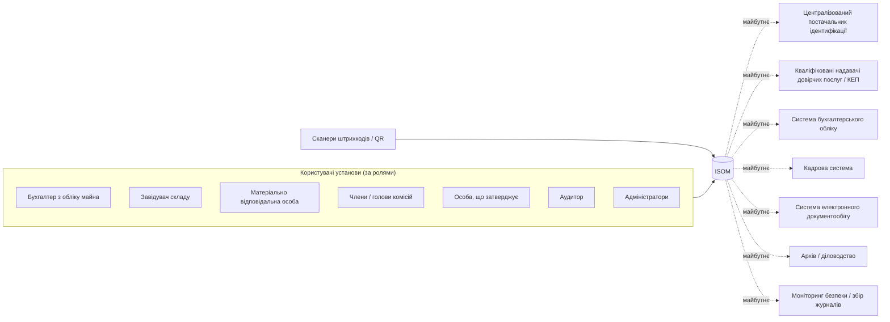
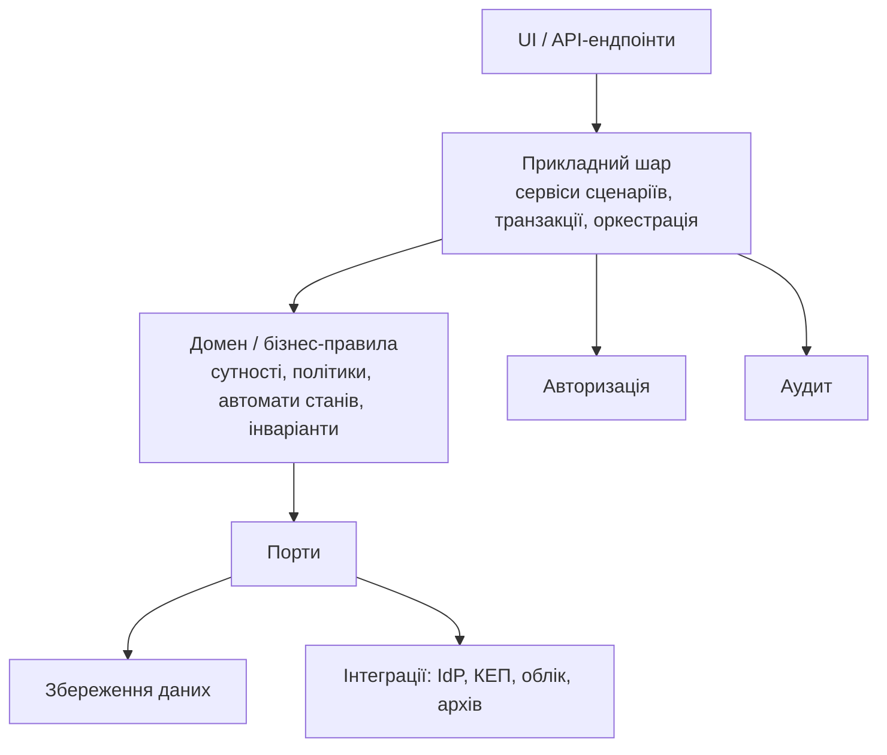

# Контекст системи

**Статус:** Чернетка · **Версія:** 0.1 · **Оновлено:** 2026-10-02

## 1. Призначення

ISOM забезпечує облік державного майна української установи публічного сектору протягом усього його життєвого циклу:

- реєстрація, надходження та введення в експлуатацію;
- закріплення за матеріально відповідальними особами (МВО);
- зберігання на складах і в місцях зберігання;
- внутрішнє переміщення та передача;
- інвентаризація;
- ремонт і технічне обслуговування;
- списання, утилізація та оприбуткування матеріалів, отриманих після розбирання;
- документи, звітність і аудит;
- архівне зберігання.

**Базовий принцип:** майно — це *доменний об'єкт із керованим життєвим циклом*. Кожна одиниця майна має повну, простежувану історію від надходження до остаточного вибуття або архівування.

## 2. Три перспективи обліку

ISOM має підтримувати три окремі перспективи щодо тієї самої одиниці майна.

| Перспектива | На яке питання відповідає | Основні дані |
|---|---|---|
| **Оперативний облік** | Де майно, у якому воно стані, хто за нього відповідає зараз? | Поточний статус, технічний стан, місце зберігання, чинне закріплення за МВО |
| **Документальний облік** | Який документ став підставою для кожної господарської операції? | Тип документа, номер, дата, статус, погодження, підписи |
| **Аудиторський облік** | Хто, що, коли і чому зробив? | Виконавець, час, об'єкт, попереднє значення, нове значення, причина, пов'язаний документ, пов'язана операція |

Оперативне подання *формується з* завершених операцій, підкріплених документами. Його ніколи не можна редагувати окремо від них (див. [BR-01](../requirements/business-rules.md)).

## 3. Межі цього інкременту

Входить до обсягу (ISOM-00):

- архітектурна та доменна документація;
- реєстр нормативних джерел і структура трасування;
- основи безпеки та класифікації даних;
- процеси та дорожня карта.

Не входить до обсягу:

- програмний код;
- вибір фреймворків і технологій;
- залежності;
- розгортання;
- схема бази даних і міграції;
- автентифікація;
- КЕП;
- генерація QR-кодів;
- звітність;
- експорт.

## 4. Контекст системи



Усі зовнішні інтеграції є **кандидатами**. Жодну не підтверджено. Потреби в інтеграції мають підтвердити технічне завдання та замовник (OQ-01).

## 5. Архітектурні принципи

| ID | Принцип | Формулювання |
|---|---|---|
| AP-01 | Єдине джерело істини | Одна одиниця майна має рівно один центральний обліковий запис. |
| AP-02 | Повна простежуваність | Зберігається повна історія від надходження до остаточного вибуття. |
| AP-03 | Операції на підставі документів | Кожна господарська операція має належну документальну підставу. |
| AP-04 | Жодних непомітних змін | Кожна суттєва зміна створює подію аудиту. |
| AP-05 | Розподіл обов'язків | Ініціювання та затвердження критичних операцій розділені: `Initiator != Approver` там, де цього вимагає політика. |
| AP-06 | Безпека за задумом | Безпека — архітектурна властивість, а не функція, яку додають пізніше. |
| AP-07 | Процеси, що визначаються законодавством | Процес обирається за схемою `Asset Category -> Applicable Regulation -> Applicable Workflow` (категорія майна → застосовний нормативний акт → застосовний процес). Процеси не зашиваються в код. |
| AP-08 | Історична цілісність | Завершені операції ніколи не видаляються фізично. Виправлення здійснюються через скасування, заміну або визнання недійсним із зазначенням причини, виконавця, часу та підстави. |
| AP-09 | Ідентифікація за QR/штрихкодом | Фізичні мітки містять лише непрозорі посилання: `QR code = secure reference to an ISOM object` (QR-код — захищене посилання на об'єкт ISOM). |
| AP-10 | Налаштовувані довідники | Категорії, типи документів, процеси, правила погодження та строки зберігання задаються конфігурацією, а не кодом інтерфейсу. |

## 6. Архітектурні рішення

Це рішення, зафіксовані у версії v0.1. Кожне з них можна переглянути лише через явну зафіксовану зміну.

| ID | Рішення | Обґрунтування |
|---|---|---|
| AD-01 | Статус майна змінюється лише через перевірені бізнес-операції, наприклад `approveTransfer()`, `completeInventory()`, `approveWriteOff()`, `returnFromRepair()`. Інтерфейс не має загальної можливості «змінити статус». | Статус — обліковий факт. Довільні зміни порушують простежуваність. |
| AD-02 | Історія зберігається в окремих історичних сутностях: AssetMovement, AssetCustody, AssetLocationHistory, AssetStatusHistory, AssetValuation, AssetMaintenance, AssetInventoryResult, AssetWriteOff, AssetDocument. Вона не зберігається у змінюваних полях Asset. | Забезпечує повну історію (AP-02). |
| AD-03 | МВО — окреме доменне поняття. Закріплення — історичний запис `CustodyAssignment` зі строком дії та документальною підставою. ПІБ ніколи не зберігається довільним текстом у записі майна. | Збереження історії закріплень і мінімізація персональних даних. |
| AD-04 | Фізичне розташування ієрархічне: Організація → Структурний підрозділ → Майданчик → Будівля → Поверх → Приміщення → Місце зберігання. Воно ніколи не є одним текстовим рядком. | Дає змогу будувати звіти, визначати межі інвентаризації та межі доступу. |
| AD-05 | Інвентаризація — самостійний бізнес-процес. Сканування та підрахунок створюють результати інвентаризації та розбіжності. Облікові дані змінюють лише затверджені коригувальні документи. | Вимога нормативних актів щодо інвентаризації та принципів цілісності. |
| AD-06 | Списання — справа (процес) з етапами, а не зміна статусу. Варіант процесу обирається за категорією майна та застосовним нормативним актом. | Різні категорії майна регулюються різними правилами. |
| AD-07 | Типи документів, їхні процеси, правила погодження та строки зберігання — налаштовувані моделі. Чинні типові форми не зашиваються в код. | Типові форми змінюються внаслідок змін до нормативних актів. |
| AD-08 | Події аудиту — повноцінні сутності, лише з додаванням записів і захистом від підробки. Їх не можна редагувати чи видаляти через звичайний інтерфейс або звичайним адміністраторам. | AP-04, аудиторський облік, вимоги безпеки. |
| AD-09 | Багатошарова архітектура: UI → Application → Domain / Business Rules → Persistence / Integrations. Бізнес-операції напряму з інтерфейсу до бази даних не допускаються. | Бізнес-правила ізольовані та придатні до тестування. |
| AD-10 | QR-коди та штрихкоди містять непрозорий ідентифікатор (`ISOM:A:<opaque-id>`). Які дані повертаються сканеру, визначає авторизація. | Мітки фізично доступні сторонім і не повинні розкривати захищені дані. |
| AD-11 | Технічне адміністрування і доступ до бізнес-даних — окремі привілеї. «Адміністратор» не означає «доступ до всього». | Мінімальні привілеї. Розподіл обов'язків. |
| AD-12 | Архітектура передбачає точки розширення для кваліфікованого електронного підпису (КЕП) документів. У першому випуску КЕП не реалізується. | Юридична значущість електронних документів. Майбутня інтеграція. |
| AD-13 | У межах ISOM-00 технологічний стек не обирається. | Вибір має ґрунтуватися на ТЗ та обмеженнях авторизації безпеки. |

## 7. Шари



Правила:

- Інтерфейс і обробники маршрутів **не містять бізнес-правил**. Вони лише викликають прикладні сервіси.
- Бізнес-правила розміщуються в доменному шарі й не залежать від інтерфейсу, фреймворків чи інфраструктури.
- Збереження даних та інтеграції доступні через абстракції (порти). Домен не знає деталей зберігання.
- Кожен сценарій, що змінює стан, виконується в одній транзакції. До неї входить і подія аудиту, тож операція та її запис аудиту фіксуються або скасовуються разом.

Приклад — затвердження списання на концептуальному рівні:

```
UI
-> WriteOffService.approve(caseId, decision, basis)        (прикладний шар)
-> Авторизація: виконавець має роль Approver у цих межах
-> WriteOffPolicy: правила категорії/нормативного акта; Initiator != Approver
-> Валідація: справа на очікуваному етапі; потрібні документи наявні
-> Початок транзакції
   -> зміна стану WriteOffCase і відповідних Asset
   -> запис подій аудиту (AuditEvent)
   -> збереження даних
-> Фіксація транзакції
```

## 8. Структура модулів

| № | Модуль | Підмодулі |
|---|---|---|
| 1 | Панель керування | — |
| 2 | Майно | Реєстр майна, Картка майна, Історія майна, Вкладення |
| 3 | Склади та місця розташування | Склади, Майданчики, Будівлі, Поверхи, Приміщення, Місця зберігання |
| 4 | Матеріально відповідальні особи | — |
| 5 | Надходження та введення в експлуатацію | — |
| 6 | Переміщення майна | Внутрішнє переміщення, Передача між МВО, Передача між підрозділами, Зовнішня передача |
| 7 | Інвентаризація | Кампанії, Комісії, Сканування, Інвентаризаційні описи, Розбіжності, Звіряння |
| 8 | Обслуговування та ремонт | — |
| 9 | Списання | Заявки, Комісія, Технічна оцінка, Затвердження, Утилізація, Отримані матеріали |
| 10 | Документи | — |
| 11 | Звіти | — |
| 12 | Аудит | — |
| 13 | Штрихкоди / QR | — |
| 14 | Довідники | — |
| 15 | Користувачі та ролі | — |
| 16 | Адміністрування | — |
| 17 | Безпека | — |

Детальні вимоги за модулями — у [functional-requirements.md](../requirements/functional-requirements.md).

## 9. Відкриті питання

| ID | Питання | Відповідальний |
|---|---|---|
| OQ-01 | З якими зовнішніми системами має інтегруватися ISOM: облік, кадри, СЕД, IdP, архів, SIEM? | Замовник / ТЗ |
| OQ-02 | ISOM — основна облікова система для вартісних показників чи вона дзеркалить окрему систему бухгалтерського обліку? | Замовник / бухгалтерія |
| OQ-03 | Модель розгортання та сегмент мережі, зокрема ізольовані чи закриті мережі. | Замовник / служба безпеки |
| OQ-04 | В обсязі одна організація чи кілька (мультитенантність)? | Замовник / ТЗ |

Див. також розділ [Майбутнє технічне завдання](../../README.md#майбутнє-технічне-завдання).
