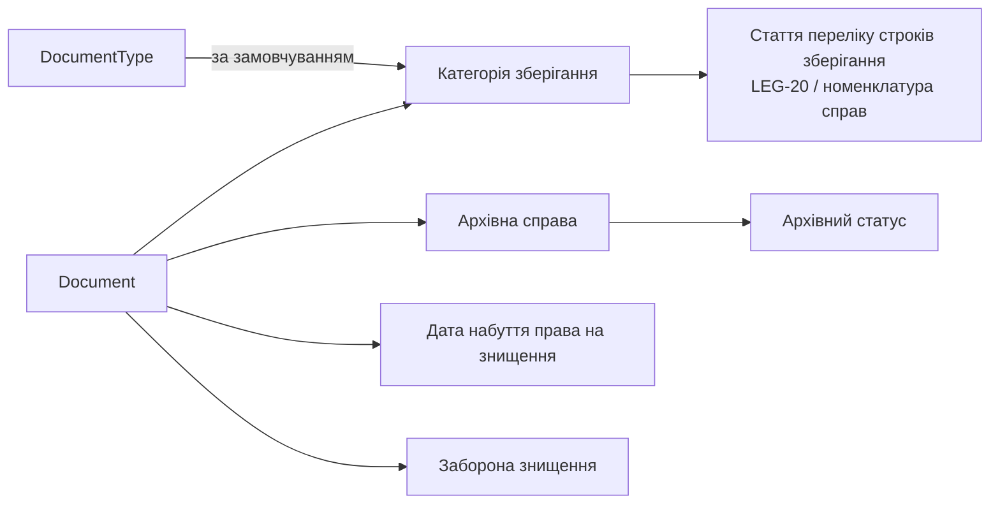

# Зберігання документів та архівування

**Статус:** Чернетка · **Версія:** 0.1 · **Оновлено:** 2026-10-02

Нормативні джерела ([реєстр нормативних джерел](legislation-register.md)):

- LEG-19 — Національний архівний фонд;
- LEG-20 — наказ Міністерства юстиції України № 578/5;
- LEG-21 — правила діловодства;
- LEG-13 — електронні документи;
- LEG-01 — бухгалтерський облік.

Усі вони потребують юридичної перевірки.

> **У цьому документі не встановлено жодних строків зберігання.** Строки потрібно брати з перевіреної чинної редакції застосовних переліків і затвердженої номенклатури справ установи. Вони вносяться як конфігурація й ніколи не зашиваються в код.

## 1. Принципи

- Документи, що брали участь у завершених господарських операціях, **ніколи** не видаляються фізично через звичайні процеси застосунку (BR-04).
- Правила зберігання поширюються на документи, їхні вкладення та підписи, а також на пов'язані з ними записи аудиту.
- Знищення — контрольована задокументована операція. Воно можливе лише після настання права на знищення та затвердження, і сам факт знищення фіксується (BR-27).

## 2. Поняття

| Поняття | Опис |
|---|---|
| Категорія зберігання | Класифікація документа для цілей зберігання. Відповідає статті застосовного переліку. |
| Строк зберігання | Тривалість, визначена для категорії: у роках, «постійно», «до заміни новими» тощо. |
| Дата початку строку | Подія, від якої відраховується строк, наприклад кінець року, у якому завершено операцію. Правило налаштовується для кожної категорії. |
| Архівна справа | Логічне об'єднання документів, що відповідає справі за номенклатурою справ установи. |
| Архівний статус | `Діючий` → `Закрито` → `Передано до архіву` → `Підлягає знищенню` → `Знищено` (запис зберігається) або `Постійно`. |
| Дата набуття права на знищення | Обчислюється від дати початку та строку. Перераховується, якщо змінюється категорія; зміна аудитується. |
| Заборона знищення | Ознака, що зупиняє знищення, наприклад на час аудиту, розслідування чи спору. |

## 3. Модель

- DocumentType задає категорію зберігання за замовчуванням. Служба діловодства може змінити її для окремого документа; зміна аудитується.
- Для знищення потрібно:
  1. щоб настала дата набуття права на знищення;
  2. щоб не діяла заборона знищення;
  3. акт про знищення, затверджений за застосовною процедурою.

  Після знищення вміст може бути вилучено відповідно до політики. Метадані документа та запис про його знищення зберігаються.

## 4. Електронні документи

- Електронні документи та їхні підписи мають залишатися придатними до перевірки протягом усього строку зберігання. Довгострокова перевірка КЕП — майбутня вимога (ISOM-16).
- Формат зберігання та захист цілісності архівних копій буде визначено разом зі службою діловодства.

## 5. Відкриті питання

- Номенклатура справ установи та відповідність категорій зберігання.
- Взаємодія з наявною системою електронного документообігу чи архівною системою (OQ-01).
- Строки зберігання записів аудиту та журналів безпеки (див. [audit-model.md](../data/audit-model.md)).
