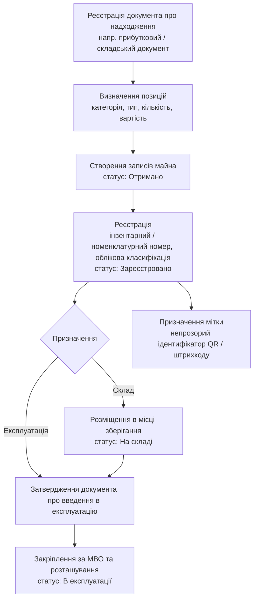

# Процес: надходження та введення в експлуатацію

**Статус:** Чернетка · **Версія:** 0.1 · **Оновлено:** 2026-10-02

Модуль: Надходження та введення в експлуатацію. Нормативні джерела: LEG-01, LEG-03, LEG-04, LEG-06, LEG-07 (потребують юридичної перевірки). Конкретні типи документів і погодження визначаються налаштованим варіантом процесу для категорії майна (AP-07).

## Кроки

| Крок | Операція | Потрібна підстава | Аудит |
|---|---|---|---|
| 1 | `receiveAsset()` | Прибутковий або складський документ | Так |
| 2 | `registerAsset()` | Той самий документ або акт приймання | Так |
| 3 | `placeInStock()` | Складський документ | Так |
| 4 | `commissionAsset()` | Документ про введення в експлуатацію (налаштований тип, LEG-06) | Так |
| 5 | `assignCustody()` | Документ про призначення МВО / документ про введення в експлуатацію | Так |
| 6 | `assignLabel()` | — | Так |

## Правила

- BR-02 — потрібна документальна підстава.
- BR-09 / BR-10 — історія закріплень.
- BR-12 — розташування з ієрархії.
- BR-13 — один центральний запис.
- BR-31 — облікова класифікація.
- Групові або кількісно облічувані позиції (запаси) можна реєструвати з кількістю > 1. Чи вести поодиничний облік, визначається налаштуванням категорії.
- Розподіл обов'язків між бухгалтером, який реєструє майно, та особою, що затверджує введення в експлуатацію, налаштовується (BR-06).

## Відкриті питання

- Чи визначає джерело надходження окремий варіант процесу? Можливі джерела: закупівля, безоплатна передача, надходження від іншої установи, надлишок за інвентаризацією, матеріали, отримані після розбирання.
- Чи потрібна інтеграція з даними закупівель або бухгалтерського обліку (OQ-01)?
