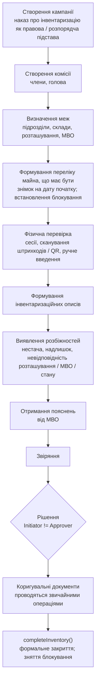

# Процес: інвентаризація

**Статус:** Чернетка · **Версія:** 0.1 · **Оновлено:** 2026-10-02

Модуль: Інвентаризація. Нормативне джерело: LEG-08 (Положення про інвентаризацію активів та зобов'язань), для документів — також LEG-07. Потребують юридичної перевірки. Склад комісії, строки та форми документів потрібно взяти з перевіреного тексту.

**Інвентаризація — самостійний бізнес-процес. Вона ніколи безпосередньо не змінює облікових залишків (AD-05, BR-14, BR-15).**

## 1. Етапи

## 2. Дані

| Сутність | Роль |
|---|---|
| InventoryCampaign | Підстава, період, межі, статус |
| InventoryCommission | Члени й голова — лише для цієї кампанії |
| InventorySession | Одна сесія перевірки (хто, коли, де, з якого пристрою) |
| InventoryItem | Очікуване та фактично виявлене: посилання на майно або неідентифікована позиція, кількість, розташування, стан, дані сканування |
| InventoryDiscrepancy | Тип, пояснення, пропоноване врегулювання, рішення, коригувальний документ |
| AssetInventoryResult | Історія результатів для кожної одиниці майна |

## 3. Правила

- **Сканування ніколи не змінює офіційних облікових даних.** Сканування лише створює або оновлює InventoryItem.
- Облікові зміни відбуваються лише через коригувальні документи після рішення, із застосуванням звичайних операцій:
  - надлишок → надходження;
  - нестача → статус «Втрачено» та/або справа списання;
  - невідповідність розташування → переміщення.
- BR-07 — автор розбіжності не може затвердити відповідне коригування.
- BR-21 — інвентаризаційне блокування забороняє конкурентні операції або вимагає дозволу.
- Сканування невідомих або відкликаних міток фіксується як розбіжність і ніколи не ігнорується мовчки.
- Ролі в комісії надаються на кампанію й припиняються разом із нею.
- Закрита кампанія доступна лише для читання. Виправлення вносяться новою задокументованою операцією.

## 4. Стани кампанії

`Заплановано → Активна → Перевірку завершено → Звіряння → Рішення ухвалено → Закрито`. До закриття можливий стан `Скасовано` із зазначенням причини.

## 5. Відкриті питання

- Чи потрібне сканування без мережі (NFR-13).
- Як проводити операції, що невідкладно потрібні під час інвентаризаційного блокування.
