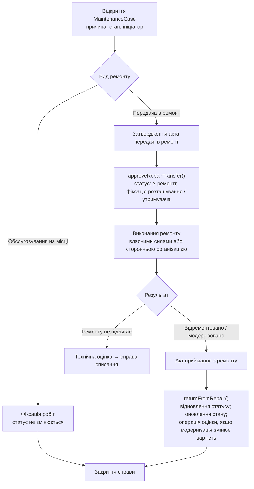

# Процес: обслуговування та ремонт

**Статус:** Чернетка · **Версія:** 0.1 · **Оновлено:** 2026-10-02

Модуль: Обслуговування та ремонт. Нормативне джерело: LEG-06 (форми передачі в ремонт або на модернізацію та повернення з ремонту). Потребує юридичної перевірки.

## Процес

## Правила

- BR-24 — під час ремонту майно залишається на балансі. Закріплення й розташування відстежуються.
- BR-01 — статус змінюється лише через `approveRepairTransfer()` і `returnFromRepair()`.
- BR-30 — модернізація, що змінює вартість, оформлюється операцією AssetValuation з підставою.
- Прострочені ремонти позначаються відносно очікуваної дати повернення.
- Замінені складові, що мають облікове значення, обробляються за правилами категорії. Це може призвести до списання або оприбуткування отриманих матеріалів (OQ-17).
