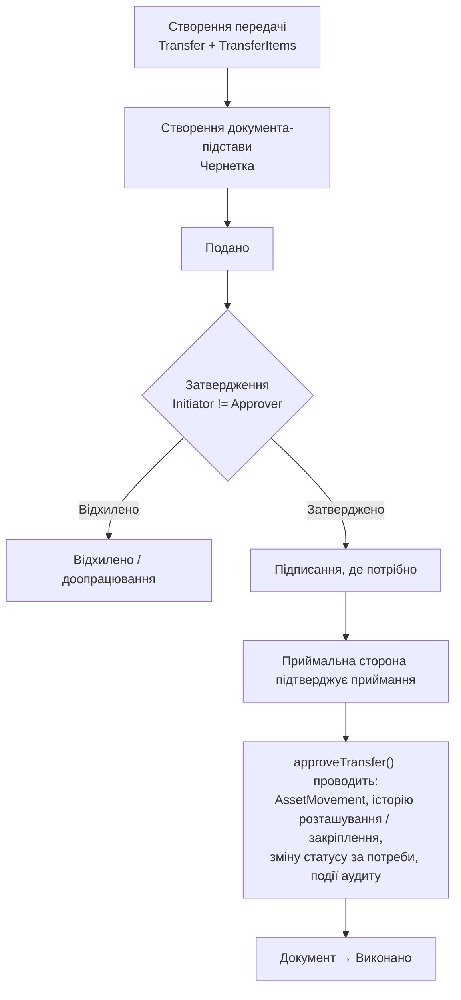

# Процес: переміщення та передача

**Статус:** Чернетка · **Версія:** 0.1 · **Оновлено:** 2026-10-02

Модуль: Переміщення майна. Нормативні джерела: LEG-06 (форми внутрішнього переміщення та приймання-передачі), LEG-09 (передача державного майна). Потребують юридичної перевірки.

## 1. Види переміщення

| Вид | Що змінюється | Типова підстава (налаштовується) | Регулювання |
|---|---|---|---|
| Між приміщеннями | Розташування (приміщення) | Акт внутрішнього переміщення або, згідно з політикою, без документа для незначних переміщень | Внутрішнє |
| Між місцями зберігання | Місце зберігання | Складський документ | Внутрішнє |
| Між складами | Склад і місце зберігання, можливо МВО | Складський документ / акт внутрішнього переміщення | LEG-07 (перевірити) |
| Між МВО | Закріплення | Акт приймання-передачі / документ про призначення МВО | LEG-06 |
| Між структурними підрозділами | Підрозділ, МВО, розташування | Акт внутрішнього переміщення | LEG-06 |
| Між установами | Балансоутримувач | Акт приймання-передачі + рішення уповноваженого органу | LEG-09 |
| Тимчасова передача | Статус → «Тимчасово передано», утримувач | Акт приймання-передачі з датою повернення | Перевірити |
| Передача в ремонт | Статус → «У ремонті» | Акт передачі в ремонт | LEG-06; див. [repair.md](repair.md) |
| Повернення з ремонту | Статус → попередній | Акт приймання з ремонту | LEG-06 |
| Зовнішня передача | Майно вибуває з балансу установи | Згідно з LEG-09 / застосовними правилами | LEG-09 |

Чи потрібен формальний документ для переміщення між приміщеннями, — рішення на рівні політики (OQ-16). Але кожне переміщення в будь-якому разі створює історію AssetMovement і подію аудиту.

## 2. Загальний процес

## 3. Правила

- BR-01 — статус, розташування й закріплення змінюються лише під час проведення.
- BR-02 — потрібна підстава.
- BR-06 — розподіл обов'язків.
- BR-09 / BR-10 — історія закріплень.
- BR-21 — заборонено під час інвентаризаційного блокування.
- BR-22 — вид визначає вимоги.
- BR-23 — дата повернення для тимчасової передачі.
- Передача між МВО потребує підтвердження приймання МВО-отримувачем або уповноваженою нею особою, якщо цього вимагає політика.
- Часткове приймання: позиції, які не прийнято, залишаються за відправником. Розбіжності фіксуються.
