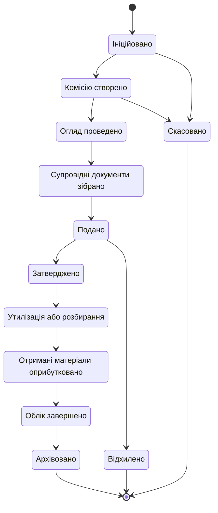

# Процес: списання

**Статус:** Чернетка · **Версія:** 0.1 · **Оновлено:** 2026-10-02

Модуль: Списання. Нормативні джерела:

- LEG-10 — наказ Адміністрації Держспецзв'язку № 440 від 19 липня 2016 року та зміни до нього;
- LEG-06 — форми списання, зокрема транспортних засобів і групових активів;
- LEG-03 та LEG-04;
- LEG-22 — внутрішні документи (заповнювач).

Потребують юридичної перевірки. Етапи, склад комісії, рівні затвердження та перелік документів потрібно взяти з перевіреного чинного тексту.

**Списання — це справа (процес), а не зміна статусу (AD-06, BR-16).**

## 1. Вибір процесу

```
Asset Category -> Applicable Regulation -> Applicable Workflow
```

- Кожна категорія визначає свій варіант процесу списання. Приклади: загальне майно, транспортні засоби, групові активи, засоби зв'язку, майно спеціального призначення, засоби криптографічного захисту інформації.
- **Якщо для категорії варіант не налаштовано, списання заблоковано (BR-17).** Єдиного процесу за замовчуванням для всього майна не передбачено.
- Варіанти для категорій, що регулюються внутрішніми або обмеженими документами, залишаються заповнювачами, доки замовник не надасть правила належним каналом (LEG-22, BR-29).
- Справа може містити лише позиції з однаковим варіантом процесу, якщо варіант явно не дозволяє змішування (OQ-18).

## 2. Етапи справи



| Етап | Основний зміст | Вплив на майно |
|---|---|---|
| Ініційовано | Заявка на списання, WriteOffItems, причина | Позиції → «Запропоновано до списання» під час подання (момент налаштовується) |
| Комісію створено | WriteOffCommission, створена наказом | — |
| Огляд проведено | TechnicalAssessment / акт технічного стану для кожної позиції | — |
| Супровідні документи зібрано | Протокол засідання комісії, експертні висновки, інші потрібні документи | — |
| Подано | Справу подано органу, що затверджує | Позиції: «Запропоновано до списання» |
| Затверджено / Відхилено | Рішення зафіксовано. `Initiator != Approver` (BR-08). | Затверджено → «Списання затверджено»; Відхилено → відновлення попереднього статусу |
| Утилізація або розбирання | Фіксація фізичної утилізації або розбирання | «Утилізовано» (порядок відносно обліку налаштовується, OQ-07) |
| Отримані матеріали оприбутковано | RecoveredMaterial оприбутковано як нові облікові одиниці (BR-18) | Створюються нові одиниці майна / запасів |
| Облік завершено | Акт списання проведено | «Списано» |
| Архівовано | Справу закрито й передано на зберігання | «Архівовано» згідно з правилами зберігання |

Деякі варіанти можуть пропускати етапи або змінювати їх порядок, наприклад коли отриманих матеріалів немає. Пропущений етап фіксується явно із зазначенням причини й ніколи не пропускається мовчки.

## 3. Правила

- BR-01, BR-02, BR-03 — перевірені операції з підставою та аудитом.
- BR-06 / BR-08 — розподіл обов'язків.
- BR-16 — «Списано» лише після завершення облікового етапу.
- BR-17 — процесу за замовчуванням немає.
- BR-18 — отримані матеріали.
- BR-21 — майно під інвентаризаційним блокуванням не можна додати без дозволу.
- Ролі в комісії надаються на справу.
- Відхилені та скасовані справи зберігаються із зазначенням причини.
